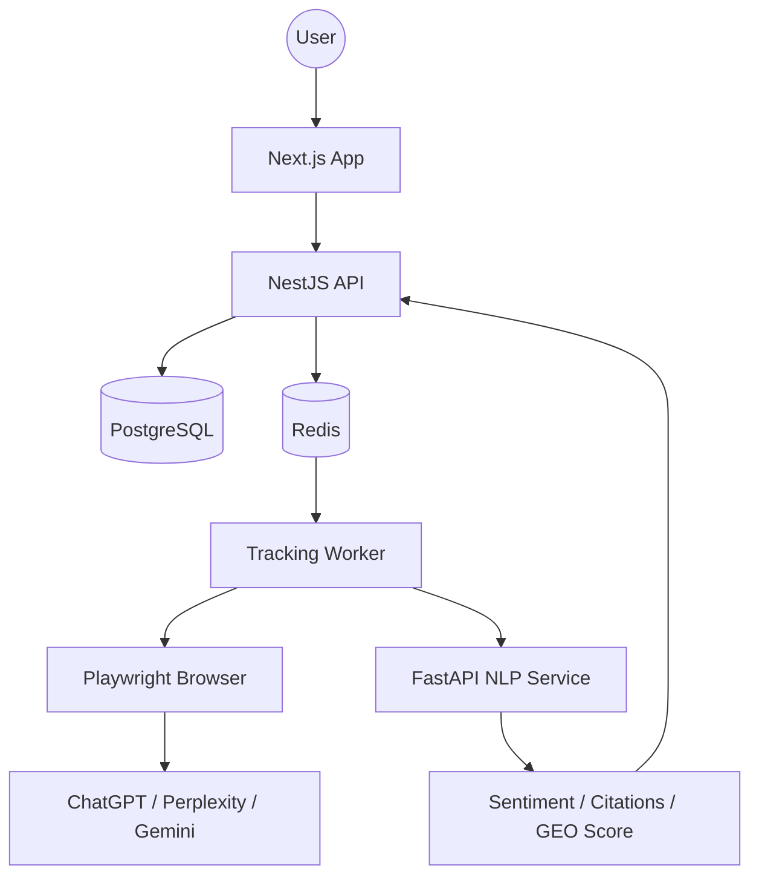

# Insight AI - Production Engineering Handbook 🛸

Insight AI is an enterprise-grade SaaS for **Generative Engine Optimization (GEO)**. This handbook documents the final release candidate architecture, deployment strategies, and operational playbooks.

---

## 🏛️ System Architecture



### Service Map
- **Web (@insight-ai/web):** React 18, Next.js 15, GSAP, Tailwind v4.
- **API (@insight-ai/api):** NestJS, Prisma, BullMQ, Stripe, JWT.
- **NLP Service:** FastAPI, Pydantic, re-based extraction.
- **Worker (@insight-ai/workers):** Node.js, Playwright, BullMQ.

---

## 🚀 Deployment & Operations

### Deployment Validation Checklist
- [ ] **Infrastructure:** Postgres & Redis clusters healthy.
- [ ] **Migrations:** `prisma migrate deploy` executed.
- [ ] **Environment:** All production secrets (Stripe, PostHog, JWT) verified.
- [ ] **Stripe:** Webhook signatures and pricing IDs matching prod.
- [ ] **Workers:** Concurrency limits set for browser isolation.
- [ ] **Health:** All `/health` endpoints returning 200.

### Rollback Procedure
1. Revert Git commit to previous stable tag.
2. Trigger CI/CD deploy.
3. If DB schema changed: Run migration rollback (if applicable) or restore from snapshot:
   ```bash
   make restore BACKUP=backup_last_stable.sql
   ```

---

## 🛠️ Developer Experience (DX)

### Quick Start
```bash
make setup
make seed
make dev
```

### Useful Commands
- `make docker-up`: Start local infrastructure.
- `make seed`: Reset and seed demo data.
- `make test`: Run full test suite (Unit & E2E).

---

## 📈 Growth & Business Metrics

### Event Flow
1. **Frontend:** User action triggers `analytics.track()` (PostHog).
2. **Backend:** Job completion triggers `NotificationService`.
3. **Admin:** Growth dashboard aggregates MRR and Activation Rate via `GrowthMetricsService`.

---

## 🛡️ Security & Compliance
- **Auth:** JWT with HTTP-only cookies.
- **Headers:** Helmet-protected API.
- **Isolation:** Multi-tenant row-level logic (simulated via Prisma filters).
- **Data:** 30-day retention for tracking logs and screenshots.

---

## 🐞 Troubleshooting Playbook
- **Job Stalls:** Check `insight-ai-redis` for memory limits or BullMQ stalled jobs.
- **Hydration Mismatch:** Ensure client-only components use `useClient` or `useEffect`.
- **Worker Crashes:** Check Playwright dependency installation in Docker (`npx playwright install-deps`).

**Version:** 1.0.0-RC1
**Status:** Launch Ready 🏁
